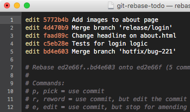

# Git workflow V1

## Create repo for project

1. `mkdir <local_repo>`
2. `cd <local_repo>`
3. `git init`
4. create new repo in github with same name as local repo, add .gitignore and license
5. `git remote add origin <remote_repo>`
6. `git pull --set-upstream origin main` (This will pull all changes in remote repo, and also track it. See `git status`)
7. `git push` (Great! You can now push changes you've made in the local repo)

**ALTERNATIVE STEPS (If you made changes in the local repo)**

6. `git pull --rebase origin main` (Pull changes from remote repo, plus rebase local repo on top of the remote repo)
7. `git branch -u origin/main` (This tells your local repo to track the remote repo. See `git status`)
8. `git push` (Nice--you can now send changes to your github. Happy coding!!!)

PS Make sure to add and commit your changes before pushing!

## Change author of commit

1. `git rebase -i <hash-of-last-good-commit>`
2. your editor will open, replace *pick* with *edit* to commits you want to change

3. `git commit --amend --author="John Doe <john@doe.org>" --no-edit`
4. `git rebase --continue`
